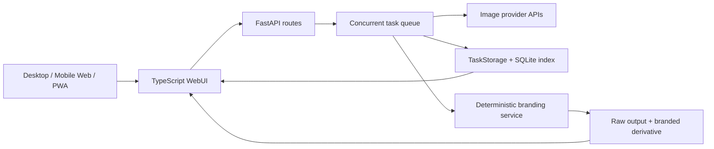

<h1 align="center">Atai Image Studio · AI Brand Image Studio</h1>

<p align="center">
  <strong>A mobile-first AI image generation, editing, and deterministic brand-compositing workspace.</strong><br />
  It turns a desktop-oriented open-source WebUI into a usable enterprise content-production workflow.
</p>

<p align="center">
  <a href="https://www.amtr.cloud/"><strong>Live Demo</strong></a>
  · <a href="docs/product-case-study.md">Product Case Study (Chinese)</a>
  · <a href="docs/architecture.md">Architecture</a>
  · <a href="README.md">中文</a>
</p>

<p align="center">
  <a href="https://github.com/lianbing22/ilab-gpt-conjure/actions/workflows/ci.yml"></a>
  
  
  
  
</p>

<p align="center">
  
</p>

## What problem this version solves

The work is not another generic text-to-image form. It addresses two delivery failures:

1. A desktop two-column workspace becomes a long, mechanically stacked form on mobile.
2. Asking an image model to draw approved logos and slogans produces inconsistent brand assets.

The branded edition keeps generation, references, output settings, task history, recovery, and deterministic brand post-processing in one mobile-first workflow. It is a deployed Web/PWA product; it does not claim a native Android or iOS release.

## My contribution

| Problem | Implementation | Evidence |
| --- | --- | --- |
| Mobile viewport consumed by chrome and empty states | `52px` header, `68px` action bar, `80px` empty preview, collapsible material and output summaries | [Mobile redesign](docs/mobile-ux-redesign.md) · [contract tests](tests/test_webui_static_mobile_workspace.py) |
| Models redraw approved marks | Deterministic Pillow post-processing with light/dark asset selection | [Compositor](codex_image/branding/compositor.py) · [tests](tests/test_branding.py) |
| Post-processing could overwrite or block delivery | Immutable raw outputs, hashed branded derivatives, idempotency, and per-image failure isolation | [Service](codex_image/branding/service.py) · [tests](tests/test_branding_service.py) |
| Concurrent metadata updates could be lost | Per-task reentrant locks and atomic temp-file + `fsync` + `os.replace` writes | [Storage](codex_image/webui/storage.py) · [tests](tests/test_webui_storage_concurrency.py) |
| Mobile task drawer wasted vertical space | Two-row header, single-row footer toolbar, queue badge, independently scrolling task list | [Drawer](codex_image/webui/frontend/src/sidebar-drawer.ts) |

<table>
  <tr>
    <td width="50%"></td>
    <td width="50%"></td>
  </tr>
</table>

## Architecture



See [architecture](docs/architecture.md), [engineering decisions](docs/engineering-decisions.md), and [testing strategy](docs/testing-strategy.md).

## Provenance and scope

This repository is a product-focused derivative of [kadevin/ilab-gpt-conjure](https://github.com/kadevin/ilab-gpt-conjure) `v0.6.2`. The upstream project provides the base generation, editing, task, and desktop packaging capabilities. The branded edition adds the mobile-first workspace and task center, brand asset/template/compositing pipeline, immutable dual-version outputs, recovery and concurrency hardening, and the `v0.1.1` branded release history.

There are no public payment, retention, or native-app store metrics yet. The next validation step is measuring mobile time-to-first-generation, completion rate, brand-compositing success, and failure recovery before investing in a native client.

Latest local verification for this repository makeover: `838 passed, 1 skipped, 338 subtests passed`, plus a successful TypeScript typecheck and frontend build.

## Run locally

Requirements: Python 3.11+ and Node.js 22+.

```bash
git clone https://github.com/lianbing22/ilab-gpt-conjure.git
cd ilab-gpt-conjure
python3 -m venv .venv
.venv/bin/python -m pip install -r requirements-webui.txt
npm ci
npm run check:webui
.venv/bin/python -m uvicorn codex_image.webui.app:app --host 127.0.0.1 --port 8787 --no-access-log
```

Open `http://127.0.0.1:8787/` and configure an OpenAI-compatible provider in Settings. Never commit API keys, OAuth files, local inputs, generated outputs, task metadata, databases, or logs.

## License

Code is licensed under [GNU AGPLv3](LICENSE). Product names, logos, corporate assets, API credentials, user prompts, and generated content are not licensed by this repository.
