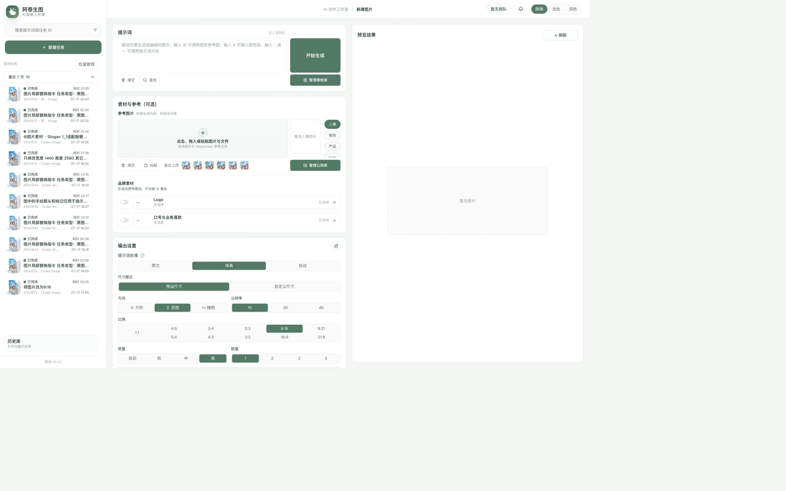
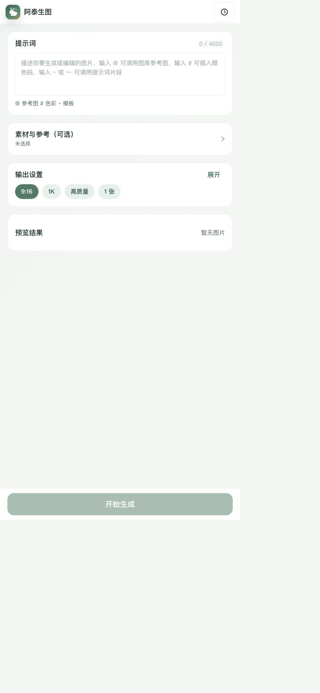
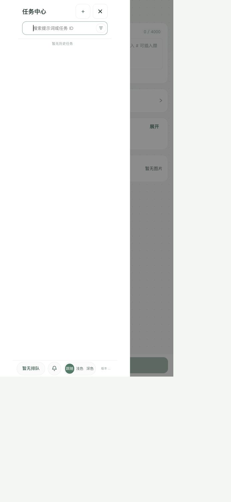
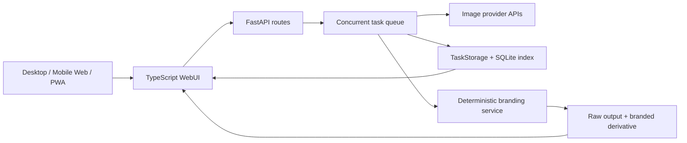

<h1 align="center">阿泰生图 · AI Brand Image Studio</h1>

<p align="center">
  <strong>面向企业内容生产的 AI 图像生成、编辑与确定性品牌合成工作台</strong><br />
  从“手机上能打开”改造为“手机上能完成生成与品牌交付”的可用产品。
</p>

<p align="center">
  <a href="https://www.amtr.cloud/"><strong>在线体验</strong></a>
  · <a href="docs/product-case-study.md">产品案例</a>
  · <a href="docs/architecture.md">架构设计</a>
  · <a href="docs/testing-strategy.md">测试策略</a>
  · <a href="README.en.md">English</a>
</p>

<p align="center">
  <a href="https://github.com/lianbing22/ilab-gpt-conjure/actions/workflows/ci.yml"></a>
  
  
  
  
</p>

<p align="center">
  
</p>

## 项目结论

问题不是再做一个通用生图页面，而是解决两个真实交付断点：

1. 桌面双栏表单在手机上机械堆叠，用户需经过长参数区才能发起生成。
2. 将 Logo 和 Slogan 写进提示词会被模型随机重画，无法满足企业品牌一致性。

品牌版将生成、编辑、参考素材、品牌合成、历史任务和失败恢复收敛到同一个移动优先工作流。当前是已部署的 Web/PWA 产品，不宣称已发布原生 Android/iOS 应用。

## 我负责的品牌版改造

| 问题 | 实现 | 可验证证据 |
| --- | --- | --- |
| 手机首屏被头部、空预览和长表单占满 | `52px` 头部、`68px` 操作栏、`80px` 空预览，素材和设置改为摘要渐进展开 | [移动端重构](docs/mobile-ux-redesign.md) · [布局契约测试](tests/test_webui_static_mobile_workspace.py) |
| AI 会改写品牌标识 | 生成后使用 Pillow 确定性叠加 Logo/Slogan，按背景自动选择明暗素材 | [合成管线](codex_image/branding/compositor.py) · [合成测试](tests/test_branding.py) |
| 品牌处理不应污染原始生成结果 | 原图不可变，品牌图作为派生版本保存；请求哈希去重，单图失败不中断整个任务 | [后处理服务](codex_image/branding/service.py) · [服务测试](tests/test_branding_service.py) |
| 多线程读改写可能丢失任务状态 | 任务级可重入锁 + 同目录临时文件 + `fsync` + `os.replace` | [存储实现](codex_image/webui/storage.py) · [并发回归测试](tests/test_webui_storage_concurrency.py) |
| 移动历史任务抽屉头尾过重 | 两行顶部、单行工具栏、队列角标，任务列表独立滚动 | [抽屉交互](codex_image/webui/frontend/src/sidebar-drawer.ts) · [移动工作区](codex_image/webui/frontend/src/mobile-workspace.ts) |

<table>
  <tr>
    <td width="50%"></td>
    <td width="50%"></td>
  </tr>
  <tr>
    <td align="center">提示词、素材摘要、输出摘要和预览状态同屏</td>
    <td align="center">任务列表获得主要垂直空间</td>
  </tr>
</table>

## 架构概览



品牌合成作为生成成功后的独立阶段，不把 Logo/Slogan 交给模型随机解释。队列保存冻结的品牌请求，工作线程写入原图后执行幂等后处理，前端同时展示原图与品牌派生图。详见 [系统架构](docs/architecture.md) 和 [工程决策](docs/engineering-decisions.md)。

## 工程证据

- 品牌分支相对上游 `v0.6.2`：18 个功能/修复提交，117 个文件变更。
- Python 测试覆盖品牌合成、服务幂等、路由、任务恢复和并发存储。
- 前端检查包含 TypeScript 类型检查、CSS 构建、esbuild 打包和生成物一致性校验。
- GitHub Actions 在 Python 3.11 / 3.12 / 3.13 上运行全量测试。
- 13 种界面语言，移动端断点、ARIA 状态和键盘交互有静态契约测试。
- 本次仓库改造的本地全量验证：`838 passed, 1 skipped, 338 subtests passed`。

可复现的命令和分层覆盖见 [测试策略](docs/testing-strategy.md)。

## 项目来源与边界

本项目基于 [kadevin/ilab-gpt-conjure](https://github.com/kadevin/ilab-gpt-conjure) `v0.6.2` 进行产品化二次开发。上游提供了基础生成、编辑、任务和桌面打包能力；本仓库的品牌版工作集中在：

- 移动优先生成工作区与任务中心。
- Logo/Slogan 素材、模板、合成和双版本结果链路。
- 品牌处理的失败隔离、幂等与崩溃恢复。
- 任务元数据的并发安全与原子写入。
- 品牌版 `v0.1.0` 更新历史与已部署运行时。

当前没有可公开的用户增长、付费或原生应用上架数据，因此不将响应式 Web/PWA 包装成 Android/iOS 原生产品。后续最小验证是记录手机端首次生成时长、完成率、品牌合成成功率和失败恢复率，而不是先重写一套原生客户端。

## 快速运行

环境：Python 3.11+ 和 Node.js 22+。公开/共享场景应使用 OpenAI-compatible API，不要将 API Key 或本地 OAuth 凭据提交到仓库。

```bash
git clone https://github.com/lianbing22/ilab-gpt-conjure.git
cd ilab-gpt-conjure
python3 -m venv .venv
.venv/bin/python -m pip install -r requirements-webui.txt
npm ci
npm run check:webui
.venv/bin/python -m uvicorn codex_image.webui.app:app --host 127.0.0.1 --port 8787 --no-access-log
```

打开 `http://127.0.0.1:8787/`，在系统设置中配置 API 供应商。

## 案例文档

- [产品案例：从通用 WebUI 到品牌图像工作台](docs/product-case-study.md)
- [移动端生成流程重构](docs/mobile-ux-redesign.md)
- [系统架构与数据流](docs/architecture.md)
- [关键工程决策](docs/engineering-decisions.md)
- [测试策略与验证命令](docs/testing-strategy.md)

## 许可证

代码遵循 [GNU AGPLv3](LICENSE)。通过网络向用户提供修改后的软件时，需按许可证提供对应源码。许可证不授权项目名称、Logo、企业素材、API 凭据、用户提示词或生成内容。
