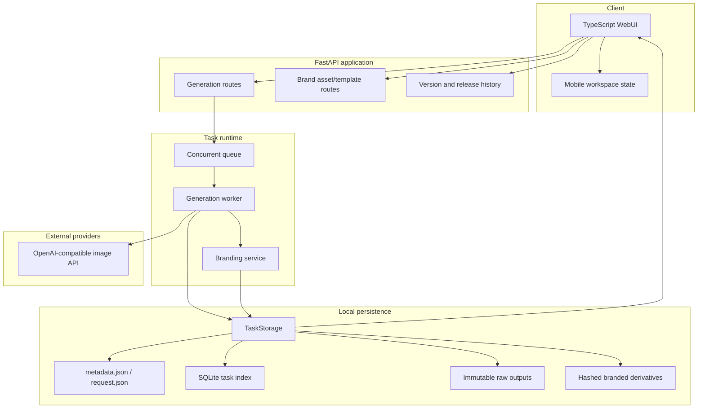

# 系统架构与数据流

## 设计结论

系统保留上游 FastAPI + TypeScript WebUI + 本地任务存储的主边界，品牌版没有将合成逻辑塞进生成提示词或前端 Canvas。品牌处理是可恢复的后端任务阶段，原图仍是不可变交付物。

## 系统视图

## 主链路

### 1. 创建任务

1. 前端提交提示词、参考图、输出参数和独立的 Logo/Slogan 模板 ID。
2. 生成路由验证请求，将当前品牌模板和素材内容冻结到任务参数。
3. 队列持久化任务，工作线程调用图像供应商。

### 2. 保存原始结果

1. 每张成功图像先写入原始输出路径。
2. 任务元数据记录逐图状态，允许部分成功与失败重试。
3. 原始输出不因后续品牌合成而更名或覆盖。

### 3. 品牌后处理

1. [BrandingService](../codex_image/branding/service.py) 读取已冻结的品牌请求。
2. [compositor](../codex_image/branding/compositor.py) 根据布局、局部对比度和素材色调合成派生图。
3. 原图内容、模板版本和素材哈希生成 `request_hash`。
4. 同一哈希已成功时直接复用，否则生成新的 `*-brand-<index>-<hash>.png`。
5. 逐图错误被记录在各自输出上，任务最终状态为 `completed` / `partial_failed` / `failed`。

### 4. 前端呈现

前端不推测文件名。它读取任务元数据中的 `branding` 记录，显示原图/品牌图操作、Logo/Slogan 图层摘要和后处理状态。历史任务恢复时优先从冻结的分层请求还原选择。

## 存储一致性

[TaskStorage](../codex_image/webui/storage.py) 使用每任务 `RLock` 保护完整的读-改-写周期，避免并发调用者各自读取旧副本后相互覆盖。文件持久化使用同目录临时文件、`fsync` 和 `os.replace`，读者不会观察到半写入 JSON。

SQLite 索引用于搜索和分页，但 JSON 元数据是真实数据源。索引 upsert 失败被记录而不回滚已成功的文件写入，避免将“搜索索引暂时失败”升级为“用户结果丢失”。

## 可扩展边界

- 图像供应商通过现有 OpenAI-compatible API 抽象接入，品牌合成不依赖特定模型。
- 品牌素材和模板通过内容哈希和版本化存储，可在不修改合成核心的情况下新增品牌套件。
- 当前队列和文件存储面向单实例/本地工作台。如果需要多实例水平扩展，任务锁、对象存储和队列需迁移到跨进程基础设施，不能将当前线程锁误当成分布式一致性。
